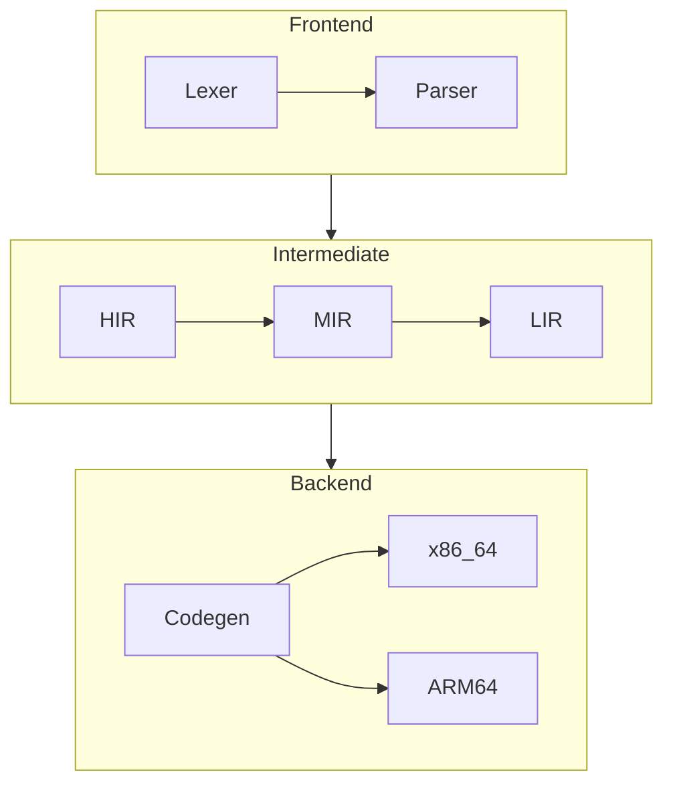

# Bootstrapping TBRN

```mermaid
flowchart TB
  subgraph s0[Frontend]
    f0[Lexer] --> f1[Parser]
  end
  subgraph s1[Intermediate]
    i0[HIR] --> i1[MIR] --> i2[LIR]
  end
  subgraph s2[Backend]
    b0[Codegen] --> b1[x86_64]
    b0[Codegen] --> b2[ARM64]
  end

  s0 --> s1 --> s2
```
